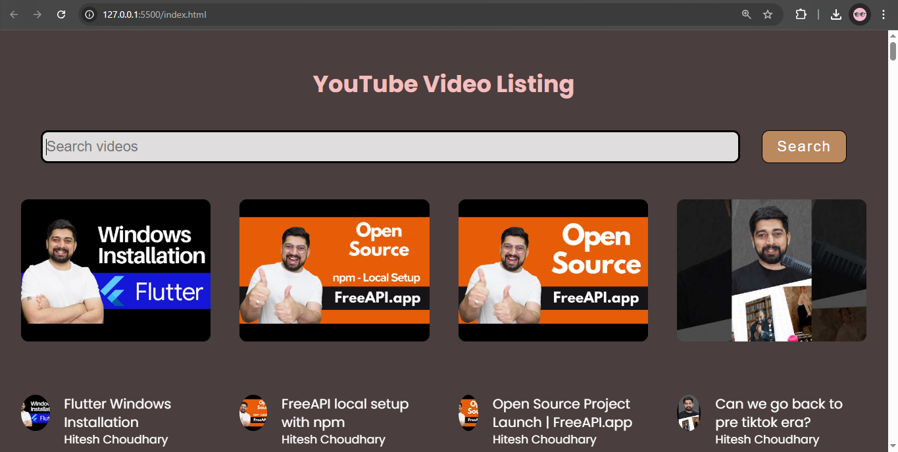

# YouTube Video Listing

A simple web application that fetches and displays YouTube videos using the FreeAPI YouTube endpoint. Users can browse videos, view thumbnails, and click to watch them on YouTube. A search feature allows filtering videos on the frontend without additional API calls.

## ✨ Features
- **Fetch** and **display** a list of YouTube videos
- Show video **thumbnails**, **titles**, and **channel names**
- Click on a video to open it in YouTube
- **Search bar** for filtering videos on the frontend
- **Grid layout** for a better user experience

## 📡 API Endpoint
The application fetches videos from the following endpoint:
GET https://api.freeapi.app/api/v1/public/youtube/videos

## 📸 Screenshots

>  

## 🚀 Deployment
You can access the live version of the application here:  
👉 https://azizul-topo.github.io/JS-02-Project/
## Technologies Used
- HTML
- CSS
- JavaScript (Fetch API for data fetching)
- FreeAPI


## 🛠 Installation & Setup

1. Clone the repository:
```bash
git clone https://github.com/azizul-topo/JS-02-Project.git
```

```bash
cd JS-02-PROJECT
```

